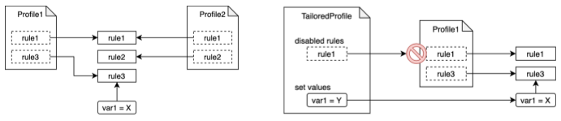
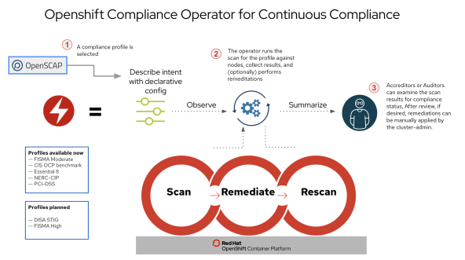
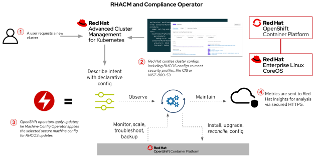

# Policy and Compliance in Red Hat cloud stack
## One capability and three perspectives!
Looks like there is still some debate about how to compare security, policy, and compliance in Red Hat different products, we are certainly talking about three products:
- Red Hat OpenShift - OCP
- Red Hat Advanced Cluster Management - RHACM
- Red Hat Advanced Cluster Security - RHACS

**We sometimes get similar feedback from existing OpenShift customers asking about differences, and similarities between OCP, RHACM, and RHACS in addition to best practices on how to use all together to manage security and compliance.**

## OpenShift Compliance Operator
Starting with Openshift, It comes with a built-in [compliance operator](http://https://github.com/openshift/compliance-operator "compliance operator") that allows administrators to describe the desired compliance state of a cluster and provides them with an overview of gaps and ways to remediate them.

The assessment requires a continuous scanning for both API resources and nodes, this happens using OpenSCAP, a NIST-certified tool, to scan and enforce security policies provided by the compliance content/configuration.

The compliance content is grouped into compliance profiles. There are numerous predefined industry standard profiles like FISMA, CIS OCP benchmark, PCI-DSS, NERC-CIP, But you can also create your own profiles.

------------

All the above mentioned features come with the OpenShift compliance operator, So OpenShift does not need any extra component to achieve this.

------------

## Red Hat Advanced Cluster Management
While It is clear the role of compliance operator in OCP, the confusion starts when we add RHACM as a management layer that already comes with policy and compliance features and here is the explaination:

**RHACM** is responsible for **creating and managing policies**, It includes the policy framework that **supports policy creation and deployment to various managed clusters** in addition to taking remediation actions when policies are violated. At the managed clusters level, RHACM provides a policy controller to evaluate one or more policies on the managed cluster against the specified controls and generates Kubernetes events for violations. Violations are propagated to the hub cluster.

### RHACM and OpenShift Compliance Operator
When compliance is mentioned in the context of RHACM, it refers to RHACM’s ability to propagate policies, using the Policy Controller from the hub cluster that runs RHACM, to managed clusters so that the same API objects are placed across the managed clusters. In this context, RHACM can define a policy to **enforce the deployment of the OpenShift compliance operator on all managed clusters** while **compliance scanning is still taken care of by the compliance operator**. RHACM also comes with built-in controllers like K8s configuration, Certificate, IAM, and policy set controllers, they all work alongside Openshift compliance operator to support a long list of policies including but not limited to namespace, pod, memory usage, Role, Role Binding, ETCD encryption, and Image vulnerability policy in addition to support for Kyverno engine policies like add network policy, add quota policy, and sync secrets policy.

`So,`RHACM does NOT provide any scanning based on the OpenSCAP contents, but it guarantees the required configurations are loaded across the managed clusters to secure them.

### RHACM and Gatekeeper/Open Policy Agent (OPA)
Having said that, RHACM is also shipped with a buit-in policy to deploy the [Gatekeeper/Open Policy Agent (OPA)](https://github.com/gatekeeper/gatekeeper-operator "Gatekeeper/Open Policy Agent (OPA)") operator on the managed clusters, after deployment, RHACM uses its policy framework to propagate Gatekeeper policy from Hub to the managed cluster.

OPA is another policy engine (CNCF graduated project), It helps in making decisions based on the policy using a policy language called Rego. API Server can be configured to query OPA for admission control decisions when API objects are created, updated, or deleted.

### RHACM and kyverno
[Kyverno](https://github.com/kyverno/kyverno "Kyverno") is a policy engine designed for Kubernetes. It can validate, mutate, and generate configurations using admission controls and background scans.
Kyverno policy sets are supported as part of Red Hat Advanced Cluster Management.
once any of the supported Kyverno cluster policies is created, RHACM will then manage where to enforce it using its placement rules.

## Red Hat Advanced Cluster Security
RHACS helps improve the security of the application build process, protect the application platform and configurations, and detect and respond to runtime issues. It comes with a **built-in policy engine** that includes hundreds of built-in controls to enforce DevOps and security-focused best practices based on industry standards such as Center for Internet Security (CIS) Benchmarks and National Institute of Standards Technology (NIST) guidelines, configuration management of both containers and Kubernetes, and runtime security.
Compliance is one of the core areas RHACS covers, as It can audit your systems against CIS Benchmarks, NIST, PCI, and HIPAA, with interactive dashboards  presenting overall systems violations, compliance statistics and top risky deployments across all managed clusters and one-click for on-demand scanning audit reports.

## Best Practices
- ### Technically
 - OpenShift provides the foundation for the platform compliance capabilities using its **OpenShift compliance operator** as a main/built-in policy engine.
 - There are other policy engines contribute the platform compliance including **GateKeeper/OPA** and **kyverno**.
 - Policy engines need to run on the managed clusters where we need to enforce the policies.
 - OpenShift provides basic admin interface to deal with policy and audit scanning outcome, as there is **no integrated reports or dashboards in OpenShift**.
[Manage compliance scans]( https://docs.openshift.com/container-platform/4.12/security/compliance_operator/compliance-scans.html "Manage compliance scans"), [Obtain scanning results](https://docs.openshift.com/container-platform/4.12/security/compliance_operator/compliance-operator-raw-results.html "Obtain scanning results"), [Manage remediation actions](https://docs.openshift.com/container-platform/4.12/security/compliance_operator/compliance-operator-remediation.html "Manage remediation actions"), All are CLI based and not through the admin web console.
 - scanning outcome can be extracted and 
- ### Manageability
 - With OpenShift alone, Cluster admins need to install the required policy engines and enable the required policies on OpenShift per cluster (**Still manageable with limited number of clusters!**)
 - In the case of multipe OpenShift clusters, RHACM offers cross cluster policy engine management as It is typically used to install those engines to all managed clusters
 - RHACM also gives full flexibilty to cluster admins on how to place different policies on different clusters 
 -  RHACS is best used to review the results via the user-friendly dashboard
 - When RHACM and RHACS are co-deployed, you can choose to enable the shared functionality in one product only, for example, we can enable the OpenShift compliance operator integration in RHACS while we focus more on other policies in RHACM.
 - once voliaions are detected, and then leverage RHACM (for platform) and Kyverno (for workload) to define policies (if not already available) to remediate any findings. Rinse and repeat until the audit person leaves the room looking a little happier.
- ### Commercially
 - OpenShift, RHACM, RHACS are different products and each one requires separate subscription
 - Red Hat provides single product bundle that include the three products in addition to Quay and OpenShift data foundation (ODF), all are sold as one bundle called OpenShift Platform Plus (OPP)
 - OPP customers are entitled to provision a hub cluster to run RHACM, RHACS, Quay, and other infrastrucutre services without consuming from OPP subscriptions 
